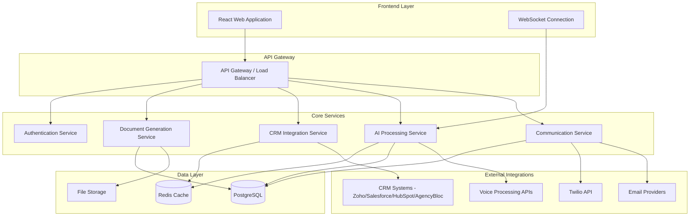

# Design Document

## Overview

The Relationship Care Platform is designed as a modern web application with a microservices architecture that prioritizes simplicity, real-time performance, and relationship-focused user experience. The system consists of four main user-facing components (Communication Center, AI Interaction Center, Relationship Enhancement Layer, Document Generation) backed by specialized services that handle email aggregation, voice processing, CRM integration, and AI decision-making.

The architecture emphasizes minimal complexity while providing powerful AI capabilities that understand context across all client interactions. As an overlay system, it integrates with existing CRMs (Zoho, Salesforce, HubSpot, AgencyBloc) without duplicating data, focusing on relationship enhancement and workflow automation. The design ensures that agents spend less time on administrative tasks and more time building meaningful client relationships.

## Architecture

### High-Level System Architecture



### Technology Stack

**Frontend:**
- React.js with TypeScript for type safety and maintainability
- Material-UI or Tailwind CSS for consistent, professional design
- WebSocket client for real-time AI interactions
- Web Speech API for voice input/output

**Backend:**
- Node.js with Express.js for rapid development and JavaScript ecosystem
- TypeScript for type safety across the stack
- WebSocket server for real-time communication
- JWT-based authentication with refresh tokens

**Database:**
- PostgreSQL for structured data (clients, tasks, communications)
- Redis for session management and real-time caching
- AWS S3 or similar for file storage (photos, documents)

**AI & Integrations:**
- OpenAI GPT-4 for natural language processing and decision-making
- LangChain/LangGraph for agentic AI workflows and multi-step task automation
- AssemblyAI or similar for speech-to-text processing
- ElevenLabs or similar for text-to-speech output
- Twilio SDK for phone/SMS integration
- IMAP/SMTP libraries for email integration
- Jinja2 for document template rendering
- WeasyPrint for HTML to PDF conversion
- CRM APIs (Zoho, Salesforce, HubSpot, AgencyBloc) for data integration

## Components and Interfaces

### 1. Communication Center Component

**Purpose:** Unified inbox for all client communications across email and phone channels.

**Key Features:**
- Multi-account email aggregation with real-time sync
- Off-hours call/text capture and transcription
- Searchable interaction timeline
- Auto-tagging and categorization
- Priority flagging for urgent communications

**API Endpoints:**
```typescript
GET /api/communications/inbox
GET /api/communications/search?query={query}
POST /api/communications/email-accounts
GET /api/communications/twilio-logs
PUT /api/communications/{id}/tags
```

**Real-time Updates:**
- WebSocket events for new emails/calls
- Push notifications for urgent communications
- Live status updates for email sync progress

### 2. AI Interaction Center Component

**Purpose:** Real-time voice AI assistant with full system context and task automation capabilities.

**Key Features:**
- Fluid circle UI that responds to voice activation
- Context-aware conversation processing with <1.5s latency
- Task extraction from natural language using LangChain/LangGraph
- Agentic AI workflows for multi-step task automation
- Autonomous action execution with risk-based approval workflows
- Multi-modal interaction (voice + text fallback)
- Agent writing style mimicry and multi-language support

**API Endpoints:**
```typescript
POST /api/ai/voice-input
GET /api/ai/context/{clientId}
POST /api/ai/execute-task
GET /api/ai/pending-approvals
PUT /api/ai/approve-action/{actionId}
```

**WebSocket Events:**
```typescript
// Client to Server
voice_input: { audio: ArrayBuffer, sessionId: string }
text_input: { message: string, sessionId: string }

// Server to Client
ai_response: { text: string, audio?: ArrayBuffer, actions?: Action[] }
task_extracted: { task: Task, requiresApproval: boolean }
action_completed: { actionId: string, result: any }
```

### 3. Relationship Enhancement Layer Component

**Purpose:** CRM overlay that enhances existing client profiles with relationship insights and conversation history without data duplication.

**Key Features:**
- CRM data fetching and display enhancement
- Relationship mapping with graph visualization
- AI-generated conversation summaries and sentiment analysis
- Pre-meeting preparation briefs from CRM data
- Relationship health scoring and interaction tracking
- Bi-directional sync with CRM systems

**API Endpoints:**
```typescript
GET /api/crm/clients
GET /api/crm/clients/{id}
PUT /api/crm/clients/{id}/sync
GET /api/crm/clients/{id}/relationships
GET /api/crm/clients/{id}/meeting-brief
POST /api/crm/clients/{id}/interactions
GET /api/crm/clients/{id}/sentiment-analysis
GET /api/crm/health-check
```

### 4. Document Generation Component

**Purpose:** Automated document creation using templates and CRM/communication data for compliance and efficiency.

**Key Features:**
- Jinja2 template-based document generation
- WeasyPrint HTML to PDF conversion
- Context-aware data population from CRM and communications
- Template management and customization
- Approval workflows for high-risk documents
- Temporary storage and export capabilities

**API Endpoints:**
```typescript
POST /api/documents/generate
GET /api/documents/templates
POST /api/documents/templates
PUT /api/documents/templates/{id}
GET /api/documents/{id}/preview
POST /api/documents/{id}/approve
GET /api/documents/{id}/download
POST /api/documents/{id}/email
```

## Data Models

### Core Entities

```typescript
interface Client {
  id: string;
  crmId: string; // Reference to CRM system record
  crmSystem: 'zoho' | 'salesforce' | 'hubspot' | 'agencybloc';
  // Core data fetched from CRM
  name: string;
  email: string;
  phone: string;
  photo?: string;
  // Overlay enhancements (cached from CRM)
  personalDetails: {
    hobbies: string[];
    family: FamilyMember[];
    preferences: Record<string, any>;
    importantDates: ImportantDate[];
  };
  // Platform-specific relationship insights
  relationshipHealth: {
    score: number;
    lastInteraction: Date;
    sentimentTrend: 'positive' | 'neutral' | 'negative';
  };
  lastCrmSync: Date;
  createdAt: Date;
  updatedAt: Date;
}

interface DocumentTemplate {
  id: string;
  name: string;
  type: 'advisory_protocol' | 'policy_summary' | 'meeting_notes' | 'custom';
  jinjaTemplate: string;
  isDefault: boolean;
  requiredFields: string[];
  riskLevel: 'low' | 'medium' | 'high';
  createdAt: Date;
  updatedAt: Date;
}

interface GeneratedDocument {
  id: string;
  templateId: string;
  clientId?: string;
  title: string;
  content: string; // HTML content
  pdfPath?: string;
  status: 'draft' | 'pending_approval' | 'approved' | 'exported';
  metadata: Record<string, any>;
  createdBy: 'agent' | 'ai';
  createdAt: Date;
  expiresAt: Date; // Temporary storage expiration
}

interface Communication {
  id: string;
  clientId: string;
  type: 'email' | 'call' | 'sms';
  direction: 'inbound' | 'outbound';
  subject?: string;
  content: string;
  timestamp: Date;
  tags: string[];
  sentiment?: number;
  isUrgent: boolean;
  source: string; // email account or phone number
}

interface Task {
  id: string;
  clientId?: string;
  description: string;
  type: 'email' | 'call' | 'meeting' | 'follow-up' | 'document';
  priority: 'low' | 'medium' | 'high';
  status: 'pending' | 'in-progress' | 'completed';
  dueDate?: Date;
  createdBy: 'agent' | 'ai';
  aiContext?: string;
  createdAt: Date;
}

interface AIAction {
  id: string;
  type: 'send_email' | 'update_client' | 'create_task' | 'schedule_meeting' | 'generate_document';
  description: string;
  payload: Record<string, any>;
  requiresApproval: boolean;
  riskLevel: 'low' | 'medium' | 'high';
  status: 'pending' | 'approved' | 'rejected' | 'executed';
  confidence: number;
  chainId?: string; // For agentic workflows
  stepNumber?: number; // Position in chain
  createdAt: Date;
}
```

### Database Schema Design

**PostgreSQL Tables:**
- `clients` - CRM overlay data and relationship insights (minimal storage)
- `communications` - All email, call, and SMS interactions
- `tasks` - Agent and AI-generated tasks
- `ai_actions` - Pending and completed AI actions
- `ai_chains` - Agentic workflow chains and their execution state
- `email_accounts` - Configured email accounts for sync
- `crm_connections` - CRM system configurations and auth tokens
- `document_templates` - Jinja2 templates for document generation
- `generated_documents` - Temporary document storage and metadata
- `conversation_summaries` - AI-generated interaction summaries
- `audit_logs` - Immutable audit trail for all system actions

**Redis Cache Structure:**
- `session:{sessionId}` - Active AI conversation context
- `crm_client:{crmSystem}:{crmId}` - Cached CRM client data (6 month expiration)
- `email_sync:{accountId}` - Email synchronization state
- `ai_queue:{agentId}` - Pending AI actions queue
- `ai_chain:{chainId}` - Active agentic workflow state
- `crm_sync:{crmSystem}` - CRM synchronization status

## Error Handling

### Client-Side Error Handling

**Network Errors:**
- Automatic retry with exponential backoff
- Offline mode with local storage fallback
- User-friendly error messages with suggested actions

**Voice Processing Errors:**
- Fallback to text input when speech recognition fails
- Audio quality indicators and troubleshooting tips
- Alternative input methods for accessibility

### Server-Side Error Handling

**Service Failures:**
- Circuit breaker pattern for external API calls
- Graceful degradation when AI services are unavailable
- Comprehensive logging with correlation IDs

**Data Integrity:**
- Transaction rollback for failed multi-step operations
- Validation at API boundaries and database constraints
- Audit trails for all data modifications

### AI Decision Errors

**Confidence Thresholds:**
- Low confidence actions automatically require approval
- Escalation workflows for ambiguous requests
- Learning from agent corrections to improve accuracy

**Safety Mechanisms:**
- Blacklist of high-risk actions that always require approval
- Rate limiting for automated actions
- Rollback capabilities for AI-generated content

## Testing Strategy

### Unit Testing
- Jest for JavaScript/TypeScript unit tests
- 90%+ code coverage for core business logic
- Mock external dependencies (APIs, databases)
- Test AI decision-making logic with various input scenarios

### Integration Testing
- API endpoint testing with supertest
- Database integration tests with test containers
- WebSocket connection and message flow testing
- Email and Twilio integration testing with mock services

### End-to-End Testing
- Playwright for browser automation testing
- Critical user journeys (email sync, AI interactions, client management)
- Voice interaction testing with synthetic audio
- Mobile responsiveness testing

### Performance Testing
- Load testing for concurrent AI conversations
- Email sync performance with large mailboxes
- Database query optimization and indexing validation
- WebSocket connection scaling tests

### Security Testing
- Authentication and authorization testing
- Input validation and SQL injection prevention
- Data encryption verification
- GDPR/HIPAA compliance validation

### User Acceptance Testing
- Agent workflow testing with real scenarios
- Usability testing for AI interaction patterns
- Accessibility testing for voice and visual interfaces
- Performance testing on various devices and networks

## Security Considerations

### Data Protection
- AES-256 encryption for data at rest
- TLS 1.3 for data in transit
- Field-level encryption for sensitive client data
- Regular security audits and penetration testing

### Access Control
- Role-based access control (RBAC) with minimal permissions
- Multi-factor authentication for agent accounts
- Session management with automatic timeout
- API rate limiting and abuse prevention

### Compliance
- GDPR compliance with data portability and deletion rights
- HIPAA compliance for healthcare-related client data
- Audit logging for all data access and modifications
- Regular compliance assessments and documentation

### AI Security
- Input sanitization for voice and text processing
- Output validation for AI-generated content
- Prompt injection prevention
- Model access controls and API key management