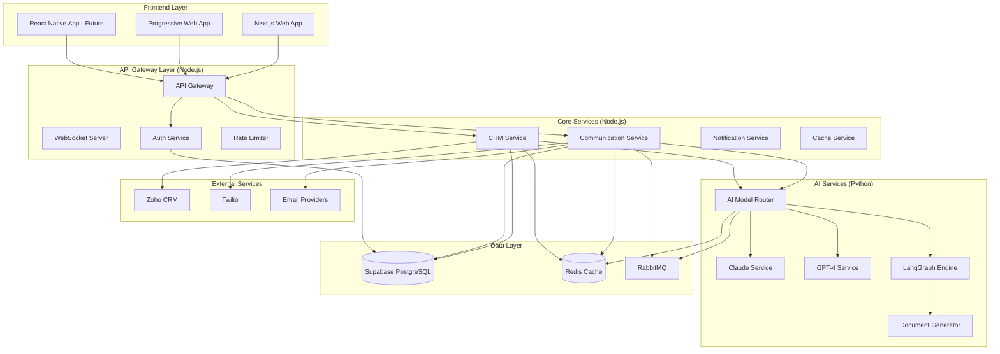

# Technology Stack Modernization Design Document

## Overview

This design document outlines the comprehensive modernization of the Relationship Care Platform's technology stack to address production readiness concerns, performance requirements, and enterprise compliance needs. The modernization focuses on migrating from experimental AI models to proven enterprise solutions, implementing realistic performance expectations, and establishing a robust microservices architecture.

## Architecture

### Current State Analysis

The existing platform uses:
- **Monolithic Node.js/Express backend** with all services in one process
- **Grok API** for AI processing (unproven for enterprise use)
- **Single CRM integration approach** without proper abstraction
- **Optimistic performance targets** (<1.5s for complex workflows)
- **Basic voice interaction** without environmental considerations
- **Limited compliance implementation** missing insurance-specific requirements

### Target Architecture



## Components and Interfaces

### 1. AI Model Router Service (Python)

**Purpose**: Intelligent routing of AI requests to appropriate models based on complexity and cost

**Key Components**:
```python
class AIModelRouter:
    def __init__(self):
        self.claude_client = ClaudeClient()
        self.gpt4_client = GPT4Client()
        self.cost_tracker = CostTracker()
        self.cache_service = CacheService()
    
    async def route_request(self, request: AIRequest) -> AIResponse:
        # Cost estimation
        estimated_cost = self.estimate_cost(request)
        
        if estimated_cost > 0.10:
            # Require approval for expensive operations
            approval = await self.request_approval(request, estimated_cost)
            if not approval.approved:
                return self.create_denial_response(approval.reason)
        
        # Check cache first
        cached_response = await self.check_cache(request)
        if cached_response:
            return self.create_cached_response(cached_response)
        
        # Route to appropriate model
        model = self.select_model(request)
        response = await self.execute_request(model, request)
        
        # Cache response
        await self.cache_response(request, response)
        
        return response
    
    def select_model(self, request: AIRequest) -> str:
        if request.type == 'simple-lookup':
            return 'gpt-3.5-turbo'  # $0.001/request
        elif request.requires_reasoning and request.complexity < 5:
            return 'claude-haiku'   # $0.01/request
        elif request.requires_compliance:
            return 'claude-sonnet'  # $0.03/request
        else:
            return 'gpt-4'         # $0.05/request
```

**Interfaces**:
```typescript
interface AIRequest {
  id: string;
  type: 'simple-lookup' | 'reasoning' | 'compliance' | 'complex';
  prompt: string;
  context?: any;
  requires_reasoning: boolean;
  requires_compliance: boolean;
  complexity: number; // 1-10 scale
  max_cost?: number;
  agent_id: string;
}

interface AIResponse {
  id: string;
  content: string;
  model_used: string;
  cost: number;
  cached: boolean;
  confidence: number;
  processing_time: number;
  error?: string;
}
```

### 2. Enhanced CRM Integration Service (Node.js)

**Purpose**: Robust abstraction layer for multiple CRM systems with proper rate limiting and field mapping

**Key Components**:
```typescript
class CRMIntegrationService {
  private connectors: Map<string, CRMConnector> = new Map();
  private rateLimiters: Map<string, RateLimiter> = new Map();
  private fieldMappers: Map<string, FieldMapper> = new Map();
  
  constructor() {
    // Initialize rate limiters for each CRM
    this.rateLimiters.set('salesforce', new RateLimiter(15000, 24 * 60 * 60 * 1000)); // 15k/24hrs
    this.rateLimiters.set('hubspot', new RateLimiter(100, 10 * 1000)); // 100/10sec
    this.rateLimiters.set('zoho', new RateLimiter(200, 60 * 1000)); // 200/min (estimated)
  }
  
  async fetchClient(crmType: string, clientId: string): Promise<UnifiedClient> {
    const rateLimiter = this.rateLimiters.get(crmType);
    if (!rateLimiter?.canMakeRequest()) {
      throw new RateLimitError(`Rate limit exceeded for ${crmType}`);
    }
    
    const connector = this.connectors.get(crmType);
    const rawData = await connector.getClient(clientId);
    
    const fieldMapper = this.fieldMappers.get(crmType);
    return fieldMapper.mapToUnified(rawData);
  }
}

interface UnifiedClient {
  id: string;
  name: string;
  email: string;
  phone: string;
  company?: string;
  policies: Policy[];
  last_contact: Date;
  source_crm: string;
  custom_fields: Record<string, any>;
}

interface FieldMapper {
  mapToUnified(rawData: any): UnifiedClient;
  mapFromUnified(unifiedData: UnifiedClient): any;
  getSupportedFields(): string[];
  getUnsupportedFeatures(): string[];
}
```

### 3. Team Collaboration Service (Node.js)

**Purpose**: Manage agent handoffs and team workflows with proper state management

**Key Components**:
```typescript
enum HandoffState {
  ACTIVE = 'active',
  HANDOFF_PENDING = 'handoff_pending',
  HANDOFF_ACCEPTED = 'handoff_accepted',
  HANDOFF_REJECTED = 'handoff_rejected',
  SHARED_OWNERSHIP = 'shared_ownership'
}

interface AgentRole {
  type: 'team_lead' | 'specialist' | 'junior_agent';
  permissions: {
    can_force_assign: boolean;
    can_receive_handoffs: boolean;
    specialties: string[];
    max_concurrent_clients: number;
  };
}

class TeamCollaborationService {
  async initiateHandoff(request: HandoffRequest): Promise<HandoffResponse> {
    // Validate handoff request
    const validation = await this.validateHandoff(request);
    if (!validation.valid) {
      throw new HandoffError(validation.reason);
    }
    
    // Create handoff record
    const handoff = await this.createHandoffRecord(request);
    
    // Notify target agent
    await this.notificationService.notifyHandoff(handoff);
    
    // Update client state
    await this.updateClientState(request.client_id, HandoffState.HANDOFF_PENDING);
    
    return { handoff_id: handoff.id, status: 'pending' };
  }
  
  async transferContext(handoffId: string): Promise<HandoffContext> {
    const handoff = await this.getHandoff(handoffId);
    
    return {
      conversation_history: await this.getConversationHistory(handoff.client_id),
      client_sentiment: await this.getSentimentAnalysis(handoff.client_id),
      active_ai_chains: await this.getActiveAIChains(handoff.client_id),
      recent_communications: await this.getRecentCommunications(handoff.client_id),
      client_preferences: await this.getClientPreferences(handoff.client_id),
      internal_notes: await this.getInternalNotes(handoff.client_id)
    };
  }
}
```

### 4. Performance Monitoring Service (Node.js)

**Purpose**: Real-time performance tracking with realistic expectations and streaming responses

**Key Components**:
```typescript
class PerformanceMonitoringService {
  private metrics: Map<string, PerformanceMetric> = new Map();
  
  async trackWorkflow(workflowId: string, type: WorkflowType): Promise<PerformanceTracker> {
    const expectedTime = this.getExpectedTime(type);
    const tracker = new PerformanceTracker(workflowId, expectedTime);
    
    // Set realistic expectations
    tracker.setExpectations({
      simple_query: 2000,      // 2 seconds
      medium_workflow: 7000,   // 5-8 seconds
      complex_workflow: 12000, // 10-15 seconds
      timeout_threshold: 30000 // 30 seconds hard timeout
    });
    
    return tracker;
  }
  
  async handleTimeout(workflowId: string): Promise<TimeoutResponse> {
    const workflow = await this.getWorkflow(workflowId);
    
    if (workflow.elapsed_time > 15000) {
      // Offer background processing
      return {
        action: 'background_processing',
        message: 'This is taking longer than expected. Continue in background?',
        estimated_completion: workflow.estimated_time
      };
    }
    
    if (workflow.elapsed_time > 30000) {
      // Hard timeout - kill the workflow
      await this.killWorkflow(workflowId);
      return {
        action: 'timeout',
        message: 'Workflow timed out. Please try again or contact support.',
        error_code: 'WORKFLOW_TIMEOUT'
      };
    }
    
    return { action: 'continue' };
  }
}
```

### 5. Compliance Management Service (Node.js)

**Purpose**: Comprehensive insurance-specific compliance with audit trails

**Key Components**:
```typescript
class ComplianceService {
  private retentionPolicies: Map<string, RetentionPolicy> = new Map();
  private auditLogger: AuditLogger;
  
  constructor() {
    // Initialize retention policies
    this.retentionPolicies.set('policy_documents', {
      retention_years: 10,
      deletion_allowed: false,
      tombstone_required: true
    });
    
    this.retentionPolicies.set('meeting_notes', {
      retention_years: 6,
      deletion_allowed: false,
      tombstone_required: true
    });
    
    this.retentionPolicies.set('communications', {
      retention_years: 7,
      deletion_allowed: true, // With tombstone
      tombstone_required: true
    });
  }
  
  async handleGDPRDeletion(clientId: string): Promise<DeletionResult> {
    const policy = this.retentionPolicies.get('communications');
    
    if (!policy.deletion_allowed) {
      throw new ComplianceError('Cannot delete: Insurance law requires retention');
    }
    
    // Create tombstone record
    const tombstone = {
      client_id: clientId,
      name: '[DELETED]',
      policy_ids: await this.getPolicyIds(clientId),
      deletion_date: new Date(),
      retention_end_date: this.calculateRetentionEnd(policy.retention_years),
      legal_basis: 'Insurance regulation retention requirement'
    };
    
    await this.createTombstone(tombstone);
    await this.deletePII(clientId);
    
    return { status: 'completed', tombstone_id: tombstone.id };
  }
  
  async validateRecordingConsent(phoneNumber: string, state: string): Promise<ConsentValidation> {
    const stateRules = await this.getStateRecordingRules(state);
    
    if (stateRules.requires_two_party_consent) {
      const consent = await this.getRecordingConsent(phoneNumber);
      if (!consent || consent.expired) {
        return {
          valid: false,
          reason: 'Two-party consent required but not obtained',
          action_required: 'obtain_consent'
        };
      }
    }
    
    return { valid: true };
  }
}
```

## Data Models

### 1. AI Request Tracking
```sql
CREATE TABLE ai_requests (
    id UUID PRIMARY KEY DEFAULT gen_random_uuid(),
    agent_id UUID NOT NULL,
    request_type VARCHAR(50) NOT NULL,
    model_used VARCHAR(50) NOT NULL,
    prompt_tokens INTEGER NOT NULL,
    completion_tokens INTEGER NOT NULL,
    cost DECIMAL(10,4) NOT NULL,
    processing_time INTEGER NOT NULL, -- milliseconds
    cached BOOLEAN DEFAULT FALSE,
    created_at TIMESTAMP DEFAULT NOW()
);

CREATE INDEX idx_ai_requests_agent_date ON ai_requests(agent_id, created_at);
CREATE INDEX idx_ai_requests_cost ON ai_requests(cost, created_at);
```

### 2. Team Collaboration
```sql
CREATE TABLE agent_handoffs (
    id UUID PRIMARY KEY DEFAULT gen_random_uuid(),
    client_id UUID NOT NULL,
    from_agent_id UUID NOT NULL,
    to_agent_id UUID,
    handoff_type VARCHAR(20) NOT NULL, -- 'manual', 'expertise', 'schedule'
    state VARCHAR(20) NOT NULL DEFAULT 'pending',
    context_data JSONB,
    reason TEXT,
    created_at TIMESTAMP DEFAULT NOW(),
    accepted_at TIMESTAMP,
    completed_at TIMESTAMP
);

CREATE TABLE agent_roles (
    agent_id UUID PRIMARY KEY,
    role_type VARCHAR(20) NOT NULL,
    permissions JSONB NOT NULL,
    specialties TEXT[],
    max_concurrent_clients INTEGER DEFAULT 50,
    created_at TIMESTAMP DEFAULT NOW()
);
```

### 3. Performance Metrics
```sql
CREATE TABLE workflow_performance (
    id UUID PRIMARY KEY DEFAULT gen_random_uuid(),
    workflow_id UUID NOT NULL,
    workflow_type VARCHAR(50) NOT NULL,
    agent_id UUID NOT NULL,
    start_time TIMESTAMP NOT NULL,
    end_time TIMESTAMP,
    total_duration INTEGER, -- milliseconds
    step_count INTEGER,
    timeout_occurred BOOLEAN DEFAULT FALSE,
    background_processing BOOLEAN DEFAULT FALSE,
    error_occurred BOOLEAN DEFAULT FALSE,
    error_type VARCHAR(50)
);
```

### 4. Compliance Audit Trail
```sql
CREATE TABLE compliance_audit_log (
    id UUID PRIMARY KEY DEFAULT gen_random_uuid(),
    event_type VARCHAR(50) NOT NULL,
    entity_type VARCHAR(50) NOT NULL,
    entity_id UUID NOT NULL,
    agent_id UUID,
    action VARCHAR(50) NOT NULL,
    before_state JSONB,
    after_state JSONB,
    compliance_rule VARCHAR(100),
    retention_date DATE,
    created_at TIMESTAMP DEFAULT NOW()
);

CREATE TABLE data_tombstones (
    id UUID PRIMARY KEY DEFAULT gen_random_uuid(),
    original_entity_id UUID NOT NULL,
    entity_type VARCHAR(50) NOT NULL,
    policy_ids TEXT[],
    deletion_date TIMESTAMP NOT NULL,
    retention_end_date DATE NOT NULL,
    legal_basis TEXT NOT NULL,
    created_by UUID NOT NULL
);
```

## Error Handling

### 1. Error Budget System
```typescript
interface ErrorBudget {
  service: string;
  error_threshold: number; // percentage
  time_window: number; // seconds
  current_error_rate: number;
  budget_remaining: number;
}

class ErrorBudgetManager {
  private budgets: Map<string, ErrorBudget> = new Map();
  
  constructor() {
    // Initialize error budgets
    this.budgets.set('ai_suggestions', {
      service: 'ai_suggestions',
      error_threshold: 1.0, // 1% error rate allowed
      time_window: 3600, // 1 hour
      current_error_rate: 0,
      budget_remaining: 100
    });
    
    this.budgets.set('document_generation', {
      service: 'document_generation',
      error_threshold: 0.5, // 0.5% error rate allowed
      time_window: 86400, // 24 hours
      current_error_rate: 0,
      budget_remaining: 100
    });
  }
  
  async recordError(service: string, error: Error): Promise<ErrorBudgetStatus> {
    const budget = this.budgets.get(service);
    if (!budget) return { action: 'continue' };
    
    // Update error rate
    budget.current_error_rate = await this.calculateErrorRate(service);
    budget.budget_remaining = Math.max(0, 
      100 - (budget.current_error_rate / budget.error_threshold * 100)
    );
    
    if (budget.current_error_rate > budget.error_threshold) {
      // Error budget exceeded
      await this.triggerErrorBudgetExceeded(service);
      return { 
        action: 'circuit_break',
        message: `Error budget exceeded for ${service}`,
        retry_after: 3600 // 1 hour
      };
    }
    
    return { action: 'continue' };
  }
}
```

### 2. Circuit Breaker Pattern
```typescript
class CircuitBreaker {
  private state: 'closed' | 'open' | 'half-open' = 'closed';
  private failureCount = 0;
  private lastFailureTime?: Date;
  
  constructor(
    private failureThreshold: number = 5,
    private recoveryTimeout: number = 60000 // 1 minute
  ) {}
  
  async execute<T>(operation: () => Promise<T>): Promise<T> {
    if (this.state === 'open') {
      if (this.shouldAttemptReset()) {
        this.state = 'half-open';
      } else {
        throw new CircuitBreakerError('Circuit breaker is open');
      }
    }
    
    try {
      const result = await operation();
      this.onSuccess();
      return result;
    } catch (error) {
      this.onFailure();
      throw error;
    }
  }
  
  private onSuccess(): void {
    this.failureCount = 0;
    this.state = 'closed';
  }
  
  private onFailure(): void {
    this.failureCount++;
    this.lastFailureTime = new Date();
    
    if (this.failureCount >= this.failureThreshold) {
      this.state = 'open';
    }
  }
}
```

## Testing Strategy

### 1. Shadow Mode Implementation
```typescript
class ShadowModeService {
  private shadowResults: Map<string, ShadowResult> = new Map();
  
  async runShadowTest(request: AIRequest): Promise<void> {
    // Run both old and new AI models in parallel
    const [oldResult, newResult] = await Promise.allSettled([
      this.oldAIService.process(request),
      this.newAIService.process(request)
    ]);
    
    const shadowResult: ShadowResult = {
      request_id: request.id,
      old_result: oldResult.status === 'fulfilled' ? oldResult.value : null,
      new_result: newResult.status === 'fulfilled' ? newResult.value : null,
      old_error: oldResult.status === 'rejected' ? oldResult.reason : null,
      new_error: newResult.status === 'rejected' ? newResult.reason : null,
      timestamp: new Date()
    };
    
    this.shadowResults.set(request.id, shadowResult);
    
    // Analyze results asynchronously
    this.analyzeResults(shadowResult);
  }
  
  async getShadowMetrics(): Promise<ShadowMetrics> {
    const results = Array.from(this.shadowResults.values());
    const total = results.length;
    
    if (total < 1000) {
      return {
        total_tests: total,
        agreement_rate: 0,
        ready_for_promotion: false,
        reason: 'Insufficient test data (need 1000+ interactions)'
      };
    }
    
    const agreements = results.filter(r => 
      this.resultsAgree(r.old_result, r.new_result)
    ).length;
    
    const agreementRate = agreements / total;
    
    return {
      total_tests: total,
      agreement_rate: agreementRate,
      ready_for_promotion: agreementRate > 0.85,
      reason: agreementRate > 0.85 ? 
        'Ready for beta promotion' : 
        `Agreement rate too low: ${agreementRate.toFixed(2)}`
    };
  }
}
```

### 2. Feature Flag System
```typescript
interface FeatureFlag {
  name: string;
  enabled: boolean;
  rollout_percentage: number; // 0-100
  enabled_for_agents: string[];
  enabled_for_teams: string[];
  requirements: {
    min_training_level?: number;
    min_experience_months?: number;
    required_certifications?: string[];
  };
}

class FeatureFlagService {
  async isFeatureEnabled(
    flagName: string, 
    agentId: string
  ): Promise<boolean> {
    const flag = await this.getFeatureFlag(flagName);
    if (!flag || !flag.enabled) return false;
    
    // Check agent whitelist
    if (flag.enabled_for_agents.includes(agentId)) return true;
    
    // Check team membership
    const agent = await this.getAgent(agentId);
    if (flag.enabled_for_teams.includes(agent.team_id)) return true;
    
    // Check requirements
    if (flag.requirements) {
      const meetsRequirements = await this.checkRequirements(
        agentId, 
        flag.requirements
      );
      if (!meetsRequirements) return false;
    }
    
    // Check rollout percentage
    const hash = this.hashAgentId(agentId);
    return (hash % 100) < flag.rollout_percentage;
  }
}
```

This design provides a comprehensive modernization plan that addresses all the critical concerns raised in the requirements while maintaining practical implementation guidelines for the engineering team.