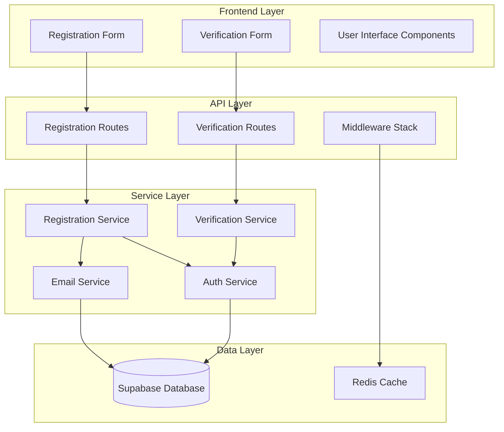

# Design Document

## Overview

The user registration system will provide a secure, user-friendly way for insurance agents and administrators to create accounts within the Relationship Care Platform. The system integrates seamlessly with the existing Supabase database infrastructure and authentication services while maintaining compliance with insurance industry security standards.

The design follows a layered architecture approach with clear separation between presentation, business logic, and data layers. Email verification ensures account security, while comprehensive validation and rate limiting prevent abuse.

## Architecture

### System Components



### Integration Points

- **Existing Authentication**: Extends current AuthService with registration capabilities
- **Database Service**: Uses existing DatabaseService and Supabase connection
- **Email Notifications**: Leverages existing EmailNotificationService
- **Rate Limiting**: Integrates with existing RateLimitingService
- **Error Handling**: Uses existing ErrorHandlingService patterns

## Components and Interfaces

### Registration Service

```typescript
interface RegistrationService {
  // Core registration functionality
  registerUser(data: RegistrationRequest): Promise<RegistrationResult>
  
  // Email verification
  sendVerificationEmail(userId: string): Promise<void>
  verifyEmail(token: string): Promise<VerificationResult>
  resendVerificationEmail(email: string): Promise<void>
  
  // Admin registration management
  approveRegistration(registrationId: string, adminId: string): Promise<void>
  rejectRegistration(registrationId: string, adminId: string, reason: string): Promise<void>
  getPendingRegistrations(): Promise<PendingRegistration[]>
}

interface RegistrationRequest {
  email: string
  password: string
  firstName: string
  lastName: string
  role?: 'agent' | 'admin'
  adminApprovalRequired?: boolean
}

interface RegistrationResult {
  success: boolean
  userId?: string
  requiresVerification: boolean
  requiresApproval: boolean
  message: string
}
```

### Email Verification Service

```typescript
interface EmailVerificationService {
  generateVerificationToken(userId: string): Promise<string>
  validateVerificationToken(token: string): Promise<TokenValidationResult>
  markEmailAsVerified(userId: string): Promise<void>
  cleanupExpiredTokens(): Promise<number>
}

interface TokenValidationResult {
  isValid: boolean
  userId?: string
  isExpired: boolean
  error?: string
}
```

### Frontend Components

```typescript
// Registration Form Component
interface RegistrationFormProps {
  onSuccess: (result: RegistrationResult) => void
  onError: (error: string) => void
  allowRoleSelection?: boolean
}

// Email Verification Component
interface EmailVerificationProps {
  email: string
  onVerificationComplete: () => void
  onResendVerification: () => void
}

// Registration Status Component
interface RegistrationStatusProps {
  status: 'pending' | 'verified' | 'approved' | 'rejected'
  message: string
  actions?: RegistrationAction[]
}
```

## Data Models

### Database Schema Extensions

```sql
-- Email verification tokens table
CREATE TABLE email_verification_tokens (
    id UUID PRIMARY KEY DEFAULT gen_random_uuid(),
    user_id UUID NOT NULL REFERENCES users(id) ON DELETE CASCADE,
    token VARCHAR(255) UNIQUE NOT NULL,
    expires_at TIMESTAMP WITH TIME ZONE NOT NULL,
    created_at TIMESTAMP WITH TIME ZONE DEFAULT CURRENT_TIMESTAMP,
    used_at TIMESTAMP WITH TIME ZONE
);

-- Registration audit log
CREATE TABLE registration_audit_log (
    id UUID PRIMARY KEY DEFAULT gen_random_uuid(),
    user_id UUID REFERENCES users(id) ON DELETE SET NULL,
    event_type VARCHAR(50) NOT NULL, -- 'registration', 'verification', 'approval', 'rejection'
    event_data JSONB,
    ip_address INET,
    user_agent TEXT,
    admin_id UUID REFERENCES users(id) ON DELETE SET NULL,
    created_at TIMESTAMP WITH TIME ZONE DEFAULT CURRENT_TIMESTAMP
);

-- Registration settings table
CREATE TABLE registration_settings (
    id UUID PRIMARY KEY DEFAULT gen_random_uuid(),
    require_admin_approval BOOLEAN NOT NULL DEFAULT false,
    allowed_email_domains TEXT[], -- NULL means all domains allowed
    max_registrations_per_day INTEGER DEFAULT 100,
    verification_token_expiry_hours INTEGER DEFAULT 24,
    updated_by UUID REFERENCES users(id),
    updated_at TIMESTAMP WITH TIME ZONE DEFAULT CURRENT_TIMESTAMP
);
```

### User Table Modifications

The existing users table already supports the required fields through migration 010:
- `email_verified` BOOLEAN for tracking verification status
- `password_hash` VARCHAR(255) for local authentication
- Existing audit fields for tracking registration events

### Redis Cache Schema

```typescript
// Rate limiting keys
const REGISTRATION_RATE_LIMIT = 'reg_limit:{ip}:{email}'
const VERIFICATION_RATE_LIMIT = 'verify_limit:{email}'

// Temporary registration data
const PENDING_REGISTRATION = 'pending_reg:{token}'

// Email verification tracking
const VERIFICATION_ATTEMPTS = 'verify_attempts:{email}'
```

## Error Handling

### Validation Errors

```typescript
interface RegistrationValidationError {
  field: string
  message: string
  code: string
  suggestions?: string[]
}

// Common validation error codes
enum ValidationErrorCodes {
  INVALID_EMAIL = 'INVALID_EMAIL',
  WEAK_PASSWORD = 'WEAK_PASSWORD',
  DUPLICATE_EMAIL = 'DUPLICATE_EMAIL',
  INVALID_NAME = 'INVALID_NAME',
  UNAUTHORIZED_ROLE = 'UNAUTHORIZED_ROLE'
}
```

### Error Recovery Strategies

1. **Duplicate Email**: Provide option to reset password or login
2. **Weak Password**: Show password strength meter and requirements
3. **Email Delivery Failure**: Offer alternative contact methods
4. **Rate Limiting**: Display clear retry timeframes
5. **Verification Expiry**: Automatic resend option

### Security Error Handling

- Log all registration attempts with IP addresses
- Implement progressive delays for repeated failures
- Alert administrators of suspicious registration patterns
- Sanitize error messages to prevent information disclosure

## Testing Strategy

### Unit Tests

```typescript
describe('RegistrationService', () => {
  describe('registerUser', () => {
    it('should create user with valid data')
    it('should reject duplicate email addresses')
    it('should validate password strength')
    it('should handle database errors gracefully')
  })
  
  describe('email verification', () => {
    it('should generate secure verification tokens')
    it('should validate token expiration')
    it('should prevent token reuse')
  })
})
```

### Integration Tests

```typescript
describe('Registration API', () => {
  it('should complete full registration flow')
  it('should handle email verification process')
  it('should enforce rate limiting')
  it('should integrate with existing auth system')
})
```

### Security Tests

```typescript
describe('Registration Security', () => {
  it('should prevent SQL injection in registration data')
  it('should rate limit registration attempts')
  it('should validate CSRF tokens')
  it('should sanitize user input')
})
```

### Frontend Tests

```typescript
describe('RegistrationForm', () => {
  it('should validate form inputs in real-time')
  it('should display appropriate error messages')
  it('should handle network failures gracefully')
  it('should provide accessibility features')
})
```

## Security Considerations

### Input Validation

- **Email Validation**: RFC 5322 compliant with domain verification
- **Password Strength**: Configurable complexity requirements
- **Name Validation**: Sanitize against XSS and injection attacks
- **Role Validation**: Strict whitelist validation

### Rate Limiting Strategy

```typescript
interface RateLimitConfig {
  registrationPerIP: { limit: 5, window: '1h' }
  registrationPerEmail: { limit: 3, window: '24h' }
  verificationAttempts: { limit: 10, window: '1h' }
  resendVerification: { limit: 3, window: '15m' }
}
```

### Token Security

- **Verification Tokens**: Cryptographically secure random generation
- **Token Expiration**: Configurable expiry (default 24 hours)
- **Single Use**: Tokens invalidated after successful verification
- **Secure Storage**: Hashed tokens in database

### Audit Logging

All registration events logged with:
- User identification (email, IP address)
- Event timestamps and types
- Request metadata (user agent, referrer)
- Admin actions (approvals, rejections)
- Security events (rate limiting, suspicious activity)

## Performance Optimization

### Database Optimization

- **Indexes**: Optimized queries for email lookups and token validation
- **Connection Pooling**: Leverage existing Supabase connection management
- **Query Optimization**: Prepared statements and efficient joins

### Caching Strategy

- **Rate Limit Data**: Redis-based counters with TTL
- **Verification Tokens**: In-memory cache for frequently accessed tokens
- **User Lookups**: Cache user existence checks

### Email Delivery

- **Queue Management**: Asynchronous email sending with retry logic
- **Template Caching**: Pre-compiled email templates
- **Delivery Tracking**: Monitor email delivery success rates

## Compliance and Audit

### GDPR Compliance

- **Data Minimization**: Collect only necessary registration data
- **Consent Management**: Clear consent for data processing
- **Right to Deletion**: Support for account deletion requests
- **Data Portability**: Export user registration data

### HIPAA Considerations

- **Encryption**: All PII encrypted at rest and in transit
- **Access Controls**: Role-based access to registration data
- **Audit Trails**: Comprehensive logging of data access
- **Data Retention**: Configurable retention policies

### SOC 2 Requirements

- **Security Controls**: Multi-factor authentication for admin functions
- **Availability**: High availability email verification system
- **Processing Integrity**: Data validation and error handling
- **Confidentiality**: Secure token generation and storage

## Monitoring and Alerting

### Key Metrics

- Registration success/failure rates
- Email verification completion rates
- Average time to complete registration
- Rate limiting trigger frequency
- Admin approval processing times

### Alert Conditions

- High registration failure rates (>10%)
- Email delivery failures (>5%)
- Suspicious registration patterns
- Database connection issues
- Rate limiting threshold breaches

### Dashboard Components

- Real-time registration statistics
- Email verification funnel analysis
- Security event monitoring
- Performance metrics tracking
- Admin approval queue status